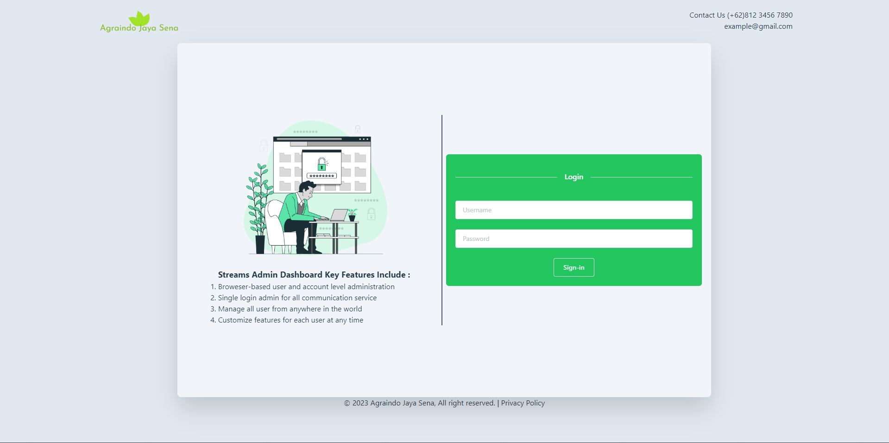
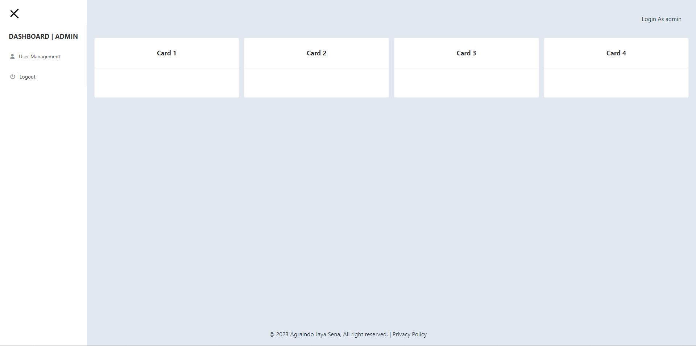
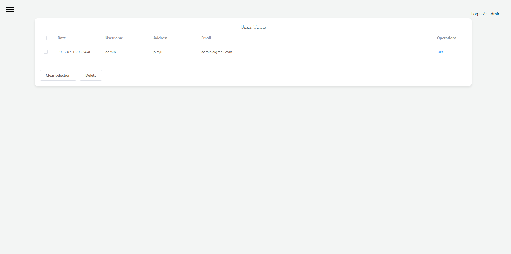

# NUXT BASIC

 

## PRODUCT IMAGE

    
    
    

<em> the page is reponsive and good for firt-learn NUXT JS and NODE JS.</em>

## FOLLOW ME
- Follow **<a href="https://twitter.com/jo_14m/">Wildy Johanes Simanjuntak</a> on Twitter**
- Follow **<a href="https://instagram.com/jo.14m">Wildy Johanes Simanjuntak</a> on Instagram**
- Add **<a href="https://www.linkedin.com/in/wildy-simanjuntak">Wildy Johanes Simanjuntak</a> on LinkedIn**

  

    <a href="https://github.com/wildy13/nuxt-basic/tree/master/backend" width="200"><strong> << Explore the Backend |</strong></a>
    <a href="https://github.com/wildy13/nuxt-basic/tree/master/frontend" width="200">Explore the Frontend  >></a>
  

